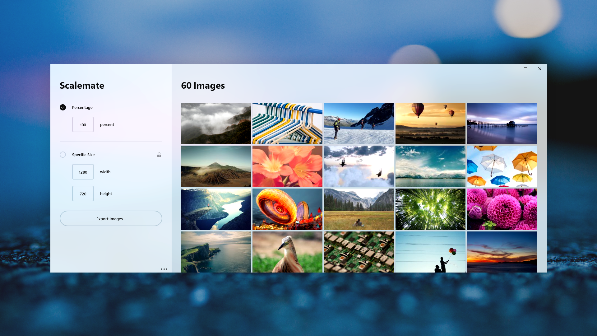

# Scalemate

Scalemate is an open source mass image scaling application built for Windows 10 as a UWP application in C# and XAML.

With an incredibly simple user interface it's effortless to create, maintain and update your colours and branding. By taking advantage of the latest Windows APIs, Paleta is more powerful than ever with support for gradients, versions and clipboard integration.

## Features

- Easy to use user interface
- Scale with percentages, specific sizes or constraining to a certain size
- Multiple Exports at different sizes (coming soon)

## Want to try it out?

You can either build it from the source or download it from the [Windows Store](https://www.microsoft.com/store/productId/9NBLGGH1XZBD).
